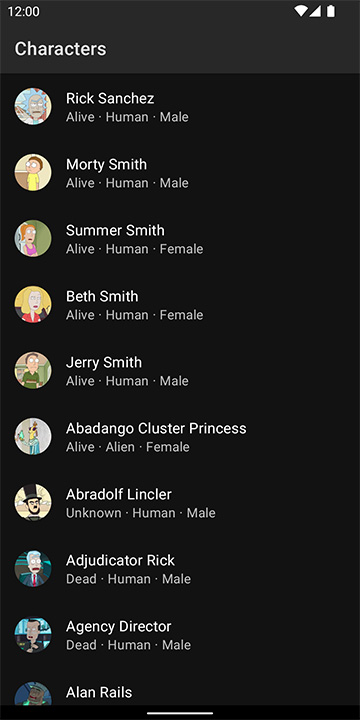
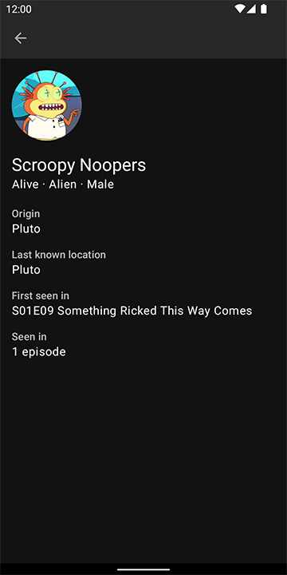

Приложение загружает и отображает информацию о персонажах
из [rickandmortyapi.com](https://rickandmortyapi.com/).

В приложении реализована пагинация, поддерживается pull-to-refresh и офлайн-режим. Присутствует
поддержка светлой и тёмной тем оформления.

   
   

## Структура проекта

На верхнем уровне классы сгруппированы в пакеты по фичам, а внутри фичей — по слоям. На
presentation-слое используется подобие MVVM.

Технологии: Kotlin coroutines, Dagger Hilt, Retrofit, Moshi, Room, Paging 3, Glide.

Несколько unit-тестов можно
найти [тут](./app/src/test/java/me/alexpetrakov/morty/common/data/cache/PageCacheTest.kt).

## Сборка

Никаких дополнительных действий для сборки не требуется. Собранный APK можно найти
на [страничке релизов](https://github.com/alex-petrakov/Morty/releases).